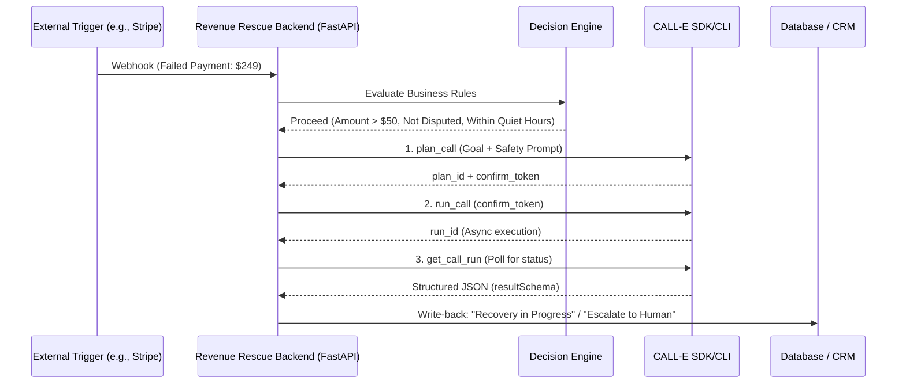
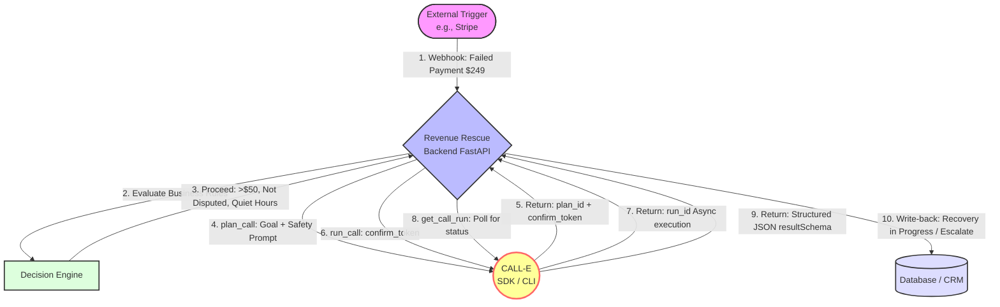

# Revenue Rescue

**Autonomous, governed revenue recovery agent skill that detects high-value operational exceptions (e.g., failed payments), evaluates business rules, and executes multi-step CALL-E phone interactions with strict safety boundaries.**

> [!NOTE]
> This skill is designed for AI agents to package, schedule, and safely execute phone-call workflows. It defaults to dry-run/preview mode and requires explicit human approval or configuration before placing live calls.

## Folder Structure

```text
skills/revenue-rescue/
├── README.md                 # This file
├── SKILL.md                  # Agent-friendly prompt and tool definitions for MCP hosts
├── references/
│   ├── safety.md             # Consent, E.164 handling, and PCI/PII boundaries
│   └── schema.json           # Strict resultSchema for structured extraction
├── scripts/
│   └── dry-run-test.sh       # Helper script to test the workflow without live calls
└── assets/
    └── architecture.png      # Mermaid or visual diagram of the workflow
```

## Architecture & Workflow





## Why This is Useful for AI-Agent Workflows

Instead of generic appointment reminders, this skill solves a direct financial bleed: failed payments and operational gaps. It provides a reusable, schema-validated workflow that agents can trigger to recover revenue, while strictly enforcing safety boundaries (no credit card collection over the phone) and idempotency to prevent duplicate calls.

## Core Workflow

1. **Trigger**: Receives a webhook payload (e.g., from Stripe, Calendly, or a logistics API) containing `customer_id`, `customer_phone`, `amount`, `failure_reason`, and `is_disputed`.
2. **Decision Engine**: Evaluates the payload against strict business rules:
   - Is `amount` > $50? (Skip low-value items to save costs).
   - Is `is_disputed` == `false`? (Route disputes directly to human/Zendesk).
   - Is the current time within allowed calling hours (08:00 - 21:00 local time)?
3. **CALL-E Execution**: If all rules pass, the agent triggers the CALL-E CLI/API with a dynamic, safety-gated goal.
4. **Structured Extraction**: CALL-E returns a validated JSON payload based on a strict `resultSchema`.
5. **Downstream Action**: 
   - If `outcome == "payment_promised"`: Update CRM, schedule follow-up.
   - If `outcome == "no_answer"`: Queue a retry in 2 hours (max 3 attempts before human escalation).

## Setup & Installation

### Prerequisites
- Node.js 18+ and `npm` (for CALL-E CLI)
- Python 3.12+ and `uv` (for the reference backend implementation)
- An authenticated CALL-E account

### 1. Install Dependencies
```bash
# Install the portable CALL-E skill globally
npx -y skills add https://github.com/CALLE-AI/call-e-integrations --skill calle -g

# Install the CALL-E CLI
npm install -g @call-e/cli
```

### 2. Authenticate CALL-E
```bash
# Start the login process (copy the URL to your browser)
env CALLE_SOURCE=skills_sh CALLE_INTEGRATION=skills_sh_skill CALLE_INTEGRATION_VERSION=0.1.0 calle auth login --start-only --no-browser-open

# Finalize login after browser authorization
env CALLE_SOURCE=skills_sh CALLE_INTEGRATION=skills_sh_skill CALLE_INTEGRATION_VERSION=0.1.0 calle auth login --no-browser-open
```

### 3. Configure Environment
Create a `.env` file in your working directory:
```env
# Set to 'true' to simulate calls and return mock structured results without using live credits
CALL_E_DRY_RUN=true
```

## Usage & Example Payload

### Trigger Webhook Example
Send a POST request to your agent's webhook endpoint with a payload like this (using **fictional** E.164 numbers):

```json
{
  "customer_id": "cus_demo_123456",
  "customer_phone": "+14045639785",
  "trigger_id": "evt_stripe_failed_987",
  "amount": 249.00,
  "failure_reason": "expired_card",
  "is_disputed": false,
  "timestamp": "2026-09-09T14:30:00Z"
}
```

### Expected Structured Result (`resultSchema`)
The skill enforces strict JSON extraction, enabling reliable downstream write-backs:

```json
{
  "outcome": "payment_promised",
  "promised_date": "2026-09-10",
  "dispute_reason": null,
  "escalation_required": false,
  "notes": "Customer agreed to update card tomorrow via the secure email link."
}
```

## Safety & Compliance Boundaries

This skill is designed with enterprise-grade safety constraints to prevent real-world side effects:

1. **NO PCI/PII Collection**: The system prompt explicitly forbids the agent from asking for, accepting, or repeating credit card numbers, CVVs, passwords, or SSNs. Users are directed to secure email links.
2. **Idempotency**: Every call attempt generates a unique SHA-256 hash (`customer_id` + `trigger_id` + `attempt_number`) to guarantee a customer is never called twice for the same invoice.
3. **Quiet Hours Guard**: The Decision Engine automatically blocks calls outside of 08:00 - 21:00 local time, queuing them for the next business day.
4. **Dispute Routing**: Known disputes bypass the phone system entirely to avoid antagonizing the customer.
5. **Cancellation & Rollback**: If a call is interrupted or returns an `unknown` status, the workflow halts and flags the record for human reconciliation rather than blindly retrying.

See `[references/safety.md](references/safety.md)` for detailed consent, credential boundary, and ambiguous outcome handling guidelines.

## Testing & Dry-Run Mode

**Dry-run mode is enabled by default** to allow safe testing without burning live CALL-E credits or placing real phone calls.

To test the complete logic flow:
```bash
# Run the provided test script
./scripts/dry-run-test.sh
```

When `CALL_E_DRY_RUN=true`, the execution engine intercepts the CLI invocation and returns a realistic, schema-compliant mock response (`outcome: "payment_promised"`), allowing developers and judges to verify the end-to-end loop instantly.

To test with a live call, set `CALL_E_DRY_RUN=false` and ensure you have explicit consent to call the target number.

## References
- [Safety & Consent Guidelines](references/safety.md)
- [Structured Result Schema](references/schema.json)
- [Agent Skill Definition](SKILL.md)

---

*Built for the CALL-E Hackathon. Turning operational chaos into governed, measurable ROI.*

---