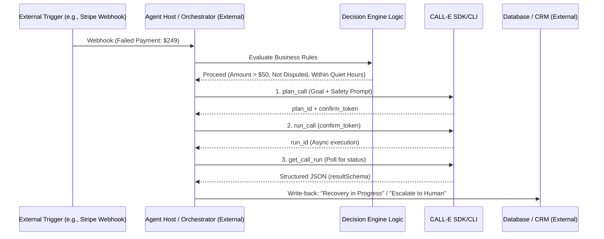

# Revenue Rescue

> [!IMPORTANT]
> **This is an Agent Skill definition package, not a runnable backend.** 
> This package does not include a backend implementation. Long-form guidance is intentionally placed in this `docs/` directory per repository guidelines. 
> To execute calls, an external agent host (e.g., Claude Code, Cursor, MCP client) or custom backend must be implemented to invoke the CALL-E CLI using the definitions provided here.

**Agent skill for packaging revenue recovery phone-call workflows with strict safety boundaries, structured result schemas, and dry-run-by-default execution.**

> [!NOTE]
> This skill defaults to dry-run/preview mode and requires explicit, destination-bound human approval before placing any live calls.

---

## Folder Structure

```text
skills/revenue-rescue/
├── SKILL.md                  # Agent-friendly prompt and tool definitions for MCP hosts
├── docs/
│   └── README.md             # This file: comprehensive documentation
├── references/
│   ├── safety.md             # Consent, E.164 handling, and PCI/PII boundaries
│   ├── schema.json           # Strict resultSchema for structured extraction
│   └── examples.md           # Safe-to-inspect examples with fictional numbers
├── scripts/
│   ├── dry-run-test.sh       # Helper script to test the workflow without live calls
│   ├── fixtures/
│   │   └── mock-payload.json # Mock webhook payload using fictional +1-555-XXXX numbers
│   └── validate-schema.py    # Validates structured results against schema.json
└── assets/
    └── architecture.png      # Mermaid sequence diagram of the workflow
```

---

## Architecture & Workflow



---

## Why This is Useful for AI-Agent Workflows

Instead of generic appointment reminders, this skill solves a direct financial pain point: failed payment recovery. It provides a reusable, schema-validated workflow definition that agent hosts can trigger, while strictly enforcing safety boundaries (no credit card collection over the phone) and idempotency to prevent duplicate calls.

---

## Core Workflow

1. **Trigger**: Receives a webhook payload containing `customer_id`, `customer_phone`, `amount`, `failure_reason`, and `is_disputed`.
2. **Decision Engine**: Evaluates the payload against strict business rules:
   - Is `amount` > $50? (Skip low-value items to save costs).
   - Is `is_disputed` == `false`? (Route disputes directly to human/Zendesk).
   - Is the current time within allowed calling hours (08:00 - 21:00 local time)?
3. **CALL-E Execution**: If all rules pass, the agent host triggers the CALL-E CLI/API with a dynamic, safety-gated goal.
4. **Structured Extraction**: CALL-E returns a validated JSON payload based on a strict `resultSchema`.
5. **Downstream Action**: 
   - If `outcome == "payment_promised"`: Update CRM, schedule follow-up.
   - If `outcome == "no_answer"`: Route to human reconciliation (**no automatic redial**).

---

## Setup & Installation

### Prerequisites
- Node.js 18+ and `npm` (for CALL-E CLI)
- Python 3.12+ and `uv` (for reference backend implementations)
- An authenticated CALL-E account

### 1. Install Dependencies
```bash
# Install the portable CALL-E skill globally
npx -y skills add https://github.com/CALLE-AI/call-e-integrations --skill calle -g

# Install the CALL-E CLI
npm install -g @call-e/cli
```

### 2. Authenticate CALL-E
```bash
# Start the login process (copy the URL to your browser)
env CALLE_SOURCE=skills_sh CALLE_INTEGRATION=skills_sh_skill CALLE_INTEGRATION_VERSION=0.1.0 calle auth login --start-only --no-browser-open

# Finalize login after browser authorization
env CALLE_SOURCE=skills_sh CALLE_INTEGRATION=skills_sh_skill CALLE_INTEGRATION_VERSION=0.1.0 calle auth login --no-browser-open
```

### 3. Configure Environment
Create a `.env` file in your working directory:
```env
# DRY-RUN MODE IS ENABLED BY DEFAULT
# Set to 'true' to simulate calls and return mock structured results without using live credits
CALL_E_DRY_RUN=true
```

---

## Usage & Example Payload

### Trigger Webhook Example
Send a POST request to your agent's webhook endpoint with a payload like this (using **standards-reserved fictional** E.164 numbers):

```json
{
  "customer_id": "cus_demo_123456",
  "customer_phone": "+1-555-0100",
  "trigger_id": "evt_stripe_failed_987",
  "amount": 249.00,
  "failure_reason": "expired_card",
  "is_disputed": false,
  "timestamp": "2026-09-09T14:30:00Z"
}
```

### Expected Structured Result (`resultSchema`)
The skill enforces strict JSON extraction, enabling reliable downstream write-backs:

```json
{
  "outcome": "payment_promised",
  "promised_date": "2026-09-10",
  "dispute_reason": null,
  "escalation_required": false,
  "notes": "Customer agreed to update card tomorrow via the secure email link."
}
```

---

## Safety & Compliance Boundaries

This skill is designed with strict safety constraints to prevent real-world side effects:

1. **NO PCI/PII Collection**: The system prompt explicitly forbids the agent from asking for, accepting, or repeating credit card numbers, CVVs, passwords, or SSNs. Users are directed to secure email links.
2. **Strict ASCII E.164 Validation**: Only valid international format numbers are accepted by the execution layer.
3. **Masked Output**: Phone numbers are masked (e.g., `+1-555-***`) in all logs, console output, and results to prevent PII leakage.
4. **Stable Intent Key**: Idempotency is derived from the authorization context and trigger ID, not the attempt number, preventing duplicate jobs from retry loops.
5. **Quiet Hours Guard**: The Decision Engine automatically blocks calls outside of 08:00 - 21:00 local time, queuing them for the next business day.
6. **Dispute Routing**: Known disputes bypass the phone system entirely to avoid antagonizing the customer.
7. **No Automatic Redial**: No-answer and ambiguous outcomes route directly to human reconciliation. The skill does not implement automatic retry cascades.
8. **Cancellation & Rollback**: If a call is interrupted or returns an `unknown` status, the workflow halts and flags the record for human reconciliation rather than blindly retrying.

See `[references/safety.md](references/safety.md)` for detailed consent, credential boundary, and ambiguous outcome handling guidelines.

---

## Testing & Dry-Run Mode

**Dry-run/no-call mode is enabled by default** to allow safe testing without burning live CALL-E credits or placing real phone calls. Exact destination-bound approval is required for any live call.

To test the complete logic flow:
```bash
# Run the provided test script
./scripts/dry-run-test.sh
```

When `CALL_E_DRY_RUN=true`, the execution engine intercepts the CLI invocation and returns a realistic, schema-compliant mock response (`outcome: "payment_promised"`), allowing developers to verify the end-to-end loop instantly.

---

## What This Is Not

To maintain clarity about the scope of this repository:
- **Not a standalone backend or service**: This package contains no backend implementing the documented enforcement.
- **Not an autonomous agent**: It does not place calls by itself; it requires an external agent host (e.g., Claude Code, Cursor, MCP client) to invoke it.
- **Not an enterprise application**: It is a skill definition package, not a turnkey SaaS product.
- **Not a runnable app**: It requires an external scheduler for recurring workflows and explicit human approval before any live CALL-E execution.

---

## References
- [Safety & Consent Guidelines](references/safety.md)
- [Structured Result Schema](references/schema.json)
- [Examples with Fictional Numbers](references/examples.md)
- [Agent Skill Definition](SKILL.md)

---

*Built for the CALL-E Hackathon. Turning operational chaos into governed, measurable ROI.*

---