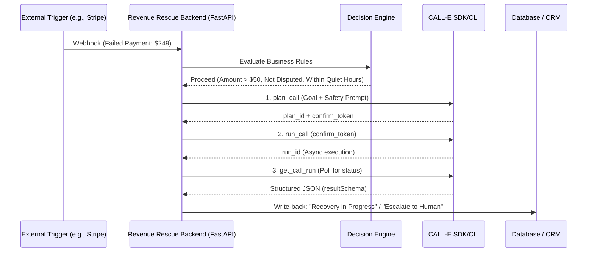

# 🚀 Revenue Rescue
**Autonomous, Governed Revenue Recovery & Operations Agent**

[](https://www.python.org/)
[](https://fastapi.tiangolo.com/)
[](https://nextjs.org/)
[](https://call-e.ai/)

Don’t use AI calling to make *more* calls; use it to recover money and operations that are actively slipping away. **Revenue Rescue** is an agentic workflow that detects high-value operational exceptions (e.g., failed Stripe payments), runs them through a "Should We Call?" decision engine, and executes a governed, multi-step CALL-E phone interaction. 

It extracts structured resolutions, respects strict safety boundaries (no PII/financial data collection), and writes actionable outcomes back to business systems—turning unstructured phone chaos into governed, measurable ROI.

---

## 🏗️ Architecture & Workflow



---

## ✨ Criteria Alignment

1. **Real-World Impact (Measurable ROI)**: Solves direct financial bleed. A SaaS company recovering just 10% of 1,000 failed payments/month saves $5,000+. The system pays for itself on Day 1.
2. **Quality of Idea (Multi-Step Cascade)**: Not a simple one-shot reminder. It evaluates *who* to call, executes the call, and uses retry cascade logic (no answer → wait 2h → retry → escalate).
3. **Technical Implementation (Deep Integration)**: Uses the official `@call-e/cli` at runtime with strict `resultSchema` enforcement, idempotency keys, and a dedicated Dry-Run mode for safe testing.
4. **Safety-First Architecture**: Explicit consent tracking, quiet-hour guards, and a **strict rule**: The agent *never* asks for or processes card numbers, passwords, or PINs.

---

## ⚡ Quick Start & Setup

This project uses [`uv`](https://github.com/astral-sh/uv) for blazing-fast Python dependency management.

### 1. Prerequisites
- Python 3.12+ and [`uv`](https://docs.astral.sh/uv/getting-started/installation/)
- Node.js 18+ and `npm`
- CALL-E CLI installed and authenticated (`npm install -g @call-e/cli` + `calle auth login`)

### 2. Backend Setup (FastAPI)
```bash
# Clone and navigate
cd revenue-rescue

# Initialize and install Python dependencies
uv sync

# Create .env file
cp .env.example .env
# Edit .env and set: CALL_E_DRY_RUN=true (for safe testing)

# Start the backend server
uv run uvicorn src.main:app --reload --port 8000
```

### 3. Frontend Setup (Next.js Dashboard)
```bash
cd frontend
npm install
npm run dev
```
Open [http://localhost:3000](http://localhost:3000) to view the Revenue Leakage Intelligence dashboard.

---

## 🛡️ Safety Boundaries (Critical)

This project is designed with enterprise-grade safety constraints to prevent disqualification and ensure compliance:
1. **NO PCI/PII Collection**: The `SYSTEM_PROMPT_TEMPLATE` explicitly forbids the agent from asking for, accepting, or repeating credit card numbers, CVVs, passwords, or SSNs.
2. **Idempotency**: Every call attempt generates a unique SHA-256 hash (`customer_id` + `trigger_id` + `attempt_number`) to guarantee a customer is never called twice for the same invoice.
3. **Quiet Hours Guard**: The Decision Engine automatically blocks calls between 9:00 PM and 8:00 AM local time, queuing them for the next business day.
4. **Dispute Routing**: Known disputes (`is_disputed: true`) bypass the phone system entirely and route directly to Zendesk/CRM to avoid antagonizing the customer.

---

## 📡 API & Example Payloads

### Trigger Webhook
**Endpoint**: `POST /webhook/revenue-rescue`

**Example Payload** (`fixtures/failed_payment.json`):
```json
{
  "customer_id": "cus_123456789",
  "customer_phone": "+15551234567",
  "trigger_id": "evt_stripe_failed_987",
  "amount": 249.00,
  "failure_reason": "expired_card",
  "is_disputed": false,
  "timestamp": "2026-09-04T14:30:00Z"
}
```

### Structured Extraction (`resultSchema`)
CALL-E is enforced to return strictly typed JSON, enabling reliable downstream write-backs:
```json
{
  "outcome": "payment_promised",
  "promised_date": "2026-09-10",
  "dispute_reason": null,
  "escalation_required": false,
  "notes": "Customer agreed to update card tomorrow via the secure email link."
}
```

---

## 🧪 Dry-Run Mode (For Judges & Testing)

To test the complete logic flow **without burning live CALL-E credits or making real phone calls**, set the following in your `.env` file:

```env
CALL_E_DRY_RUN=true
```

When enabled, the `execute_rescue_call` function intercepts the CLI invocation and returns a realistic, schema-compliant mock response (`payment_promised`), allowing judges to verify the end-to-end loop instantly.

---

## 📦 Deliverables Checklist

- [x] **Backend**: Python/FastAPI with genuine runtime CALL-E CLI execution (`plan_call` → `run_call` → `get_call_run`).
- [x] **Frontend**: Next.js Dashboard with "Revenue at Risk" and "Leakage Intelligence" analytics.
- [x] **SKILL.md**: Agent-friendly prompt and tool definitions for MCP hosts (included in repo root).
- [x] **Demo Video**: < 3-minute unlisted video demonstrating the full loop (Link in Devpost).
- [x] **Safety Documentation**: Explicitly documented and enforced in code.

---

## 🎬 Demo Video

Watch the full <3 minute walkthrough of the Decision Engine, CALL-E runtime execution, and structured write-back:  
🔗 *[Insert Unlisted YouTube/Vimeo Link Here]*

---

*Built for the CALL-E Hackathon 2026. Turning operational chaos into governed, measurable ROI.*

---
